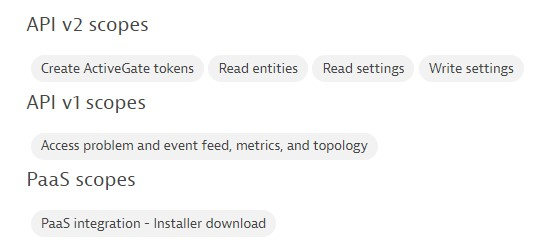

# K8s Workshop

## Step 1 - Prerequisites
- Hypervisor installation (VMWare, Hyper-V, Qemu,...)
- Ubuntu20.04 64bit (desktop or server)  
  - 40GB disk  
  - 8GB RAM
- Access internet
- Dynatrace tenant where you can create access tokens

## Step 2 - prepare linux
open terminal and type the following commands:  
`$ sudo apt-get update`  
`$ sudo apt-get -y install ca-certificates curl gnupg dos2unix`

## Step 3 - install [Docker](https://docs.docker.com/engine/install/ubuntu/)
`$ for pkg in docker.io docker-doc docker-compose podman-docker containerd runc; do sudo apt-get remove $pkg; done`  
`$ sudo install -m 0755 -d /etc/apt/keyrings`  
`$ sudo curl -fsSL https://download.docker.com/linux/ubuntu/gpg | sudo gpg --dearmor -o /etc/apt/keyrings/docker.gpg`  
`$ sudo chmod a+r /etc/apt/keyrings/docker.gpg`  
`$ echo
  "deb [arch="$(dpkg --print-architecture)" signed-by=/etc/apt/keyrings/docker.gpg] https://download.docker.com/linux/ubuntu
  "$(. /etc/os-release && echo "$VERSION_CODENAME")" stable" |
  sudo tee /etc/apt/sources.list.d/docker.list > /dev/null`  
`$ sudo apt-get update`  
`$ sudo apt-get install docker-ce docker-ce-cli containerd.io docker-buildx-plugin docker-compose-plugin`

## Step 4 - install [kubectl](https://kubernetes.io/docs/tasks/tools/install-kubectl-linux/)
`$ curl -LO "https://dl.k8s.io/release/$(curl -L -s https://dl.k8s.io/release/stable.txt)/bin/linux/amd64/kubectl"`  
`$ sudo install -o root -g root -m 0755 kubectl /usr/local/bin/kubectl`

## Step 5 - install [Kind](https://kind.sigs.k8s.io/docs/user/quick-start/)
`$ [ $(uname -m) = x86_64 ] && curl -Lo ./kind https://kind.sigs.k8s.io/dl/v0.20.0/kind-linux-amd64`  
`$ sudo chmod +x kind; sudo mv kind /usr/local/bin`

## Step 6 - install k8s cluster with Kind
`$ curl -LO https://raw.githubusercontent.com/dt-wv/k8s/main/workshop/kind-setup.yaml`    
`$ sudo kind create cluster --config kind-setup.yaml`  
[kind-setup.yaml](https://kind.sigs.k8s.io/docs/user/quick-start/#multi-node-clusters)

### Verify k8s cluster
`$ sudo kubectl get nodes`  
[Kubectl cheatsheet](https://kubernetes.io/docs/reference/kubectl/cheatsheet/)

## Step 7 - install Dynatrace as CloudNativeFullStack
`$ sudo su -`

Go to link to Dynatrace [CloudNativeFullStack](https://www.dynatrace.com/support/help/setup-and-configuration/setup-on-k8s/installation/cloud-native-fullstack) and execute all steps until step 4  

<b>Operator token scopes:</b>  

<b>Data ingest token scopes:</b>  

Dynakube can be downloaded [here](https://raw.githubusercontent.com/dt-wv/k8s/main/workshop/dynakube-cloudnativefullstack.yml)  
`# curl -LO https://raw.githubusercontent.com/dt-wv/k8s/main/workshop/dynakube-cloudnativefullstack.yml`     
`# kubectl apply -f dynakube-cloudnativefullstack.yml`

